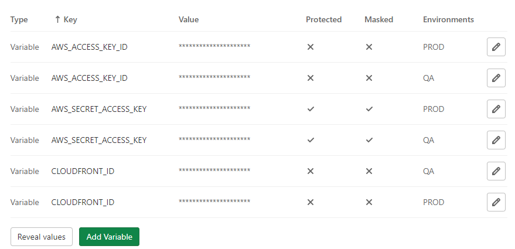

# GitLab CI/CD로 AWS의 S3/CloudFront에 배포
공식 문서: [https://docs.gitlab.com/ee/ci/cloud_deployment/](https://docs.gitlab.com/ee/ci/cloud_deployment/)
## 준비물
- aws access key과 secret key
- S3 버킷
- cloudfront 배포

## gitlab에서 CI/CD Variables 추가
1. Setting > CI/CD > Variables에 AWS_ACCESS_KEY_ID와 AWS_SECRET_ACCESS_KEY와 CLOUDFRONT_ID를 추가한다.


2. AWS_ACCESS_KEY_ID와 AWS_SECRET_ACCESS_KEY는 
    - 이미 로그인이 되어있다면 IAM > 역할에서 얻을 수 있다.
    - 역할 권한 신청했을때 인프라팀에 요청해서 받은 credential이다.
3. CLOUDFRONT_ID는 cloudfront 에서 원하는 위치의 ID를 복사한다.

## .gitlab-ci.yml 작성
1. repository에 `.gitlab-ci.yml`을 추가한다.
2. 
``` yaml
variables: 
  SOURCE_PATH: ((경로))
  S3_OPTION: --recursive --metadata-directive REPLACE --cache-control max-age=5184000

stages: 
  - build
  - deploy
# 이 전 작업과 동일한 내용인지를 확인해서 캐싱해준다.
cache:
  paths:
    - node_modules/
# 빌드
build: # 이름
  image: node:latest # 베이스 이미지
  stage: build # stage
  tags: # 정확히는 모르겠지만 설정안하면 runner 설정을 해야한다면서 작동을 안한다. Shared runners있으면 넣으면 되는듯.
    - ((Shared runners))
  script: 
    - yarn
    - yarn run "build:qa"
    - yarn run "build:live"
  artifacts:
    expire_in: 1 hour
    paths:
      - dist
  only:
  - master

deploy-to-s3-dq:
  stage: deploy
  image: ((베이스 이미지)) # 베이스 이미지가 딱히 없다면 python:latest 을 적고 script에서 aws cli 설치 해줘야 함.
  tags:
    - ((Shared runners))
  variables:
    S3_BUCKET: ((S3 버킷이름))
  script:
    - aws s3 cp dist/qa/ s3://$S3_BUCKET/$SOURCE_PATH/qa --recursive
    - eval aws s3 cp s3://$S3_BUCKET/$SOURCE_PATH/qa s3://$S3_BUCKET/$SOURCE_PATH/qa "$S3_OPTION"
    - aws cloudfront create-invalidation --distribution-id $CLOUDFRONT_ID --paths "/$SOURCE_PATH*"
  environment: QA
  only:
    - master

deploy-to-s3-prod:
  stage: deploy
  image: ((베이스 이미지)) # 베이스 이미지가 딱히 없다면 python:latest 을 적고 script에서 aws cli 설치 해줘야 함.
  tags:
    - ((Shared runners))
  variables:
    S3_BUCKET: ((S3 버킷이름))
  script:
    - aws s3 cp dist/live/ s3://$S3_BUCKET/$SOURCE_PATH/live --recursive
    - eval aws s3 cp s3://$S3_BUCKET/$SOURCE_PATH/live s3://$S3_BUCKET/$SOURCE_PATH/live "$S3_OPTION"
    - aws cloudfront create-invalidation --distribution-id $CLOUDFRONT_ID --paths "/$SOURCE_PATH*"
  environment: PROD
  only:
    - master
  when: manual # 이걸해주면 push했을때 자동으로 돌아가는게 아니라 수동으로 버튼을 눌러줘야 함.

```