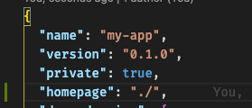

# PUBLIC_URL 경로 설정

## 가장 쉬운 방법
 homepage:'./'" />
`package.json`에서 homepage: "./"

## 주의사항
CRA(Create React App)에서 react-router를 사용하고, 상단에 명시한 homepage를 건드렸을때, build후 파일 실행시 router가 잘 작동하지 않을 수 있음.  
원인은 서버에선 index.html은 알지만 경로가 바꼈을 때 해당경로가 index.html파일을 불러줘야 되는지 모르기 때문이라고 한다. 
보통 리액트를 사용하면 웹클라이언트만 작성하기 때문에 따로 설정이 불가능하다.  
그러므로 최대한 변경하지 않는 것을 추천한다.
