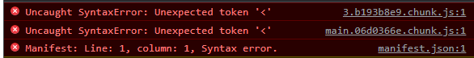

# Syntaxerror unexpected token
## 증상
Create React App으로 App 제작시 react router의 path가 2개 이상일때 발생한다.  
화면에 아무것도 나오지 않으며, 아래와 같은 오류가 나타난다.  
  

`Uncaught SyntaxError: Unexpected token '<'`

## 해결
> https://stackoverflow.com/questions/54340240/create-react-app-build-uncaught-syntaxerror-unexpected-token

### TL;DR
package.json에 homepage 옵션을 줬다면 뺀다.

## 원인 
react는 client side rendering(CSR)이다. (Nextjs 같이 Server side rendering(SSR)용 react도 있고 react 18에서는 SSR도 지원할거같지만 이건 논외로 치고..). react-router가 동작하는 방식은 경로 변경이 일어났을때 페이지 이동을 막고 우리가 그 경로에 연결해둔 화면을 보여주는것 뿐이다.  그러기 위해서는 build했을 때 생성된 `index.html`을 열어서 거기에 넣어놓은 `main.js`를 실행시켜 react를 실행시켜야한다. 그런데 **서버는 이 사실을 모른다**. 그래서 `localhost:3000/info/1` 이런 경로에 바로 접속했을때 `localhost:3000`에 있는 index.html을 연결을 못해주는것이다!  
해결법은 1) 서버 옵션에서 기본으로 항상 index.html 을 호출하도록 한다. 2) Creact react app으로 만들었을시에는 package.json에서 homepage옵션을 변경한다.