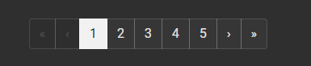

<!-- @format -->

# 클릭 가능한 것들에 href 추가

## 문제

react 와 react-router를 함께 쓰다보면 클릭시 화면이 바뀌게 만들 수 있다. 예를 들어 아래 그림처럼 pagination이 있다.

<div></div>
react router를 사용하면 페이지 버튼을 누르면 페이지가 이동되지만, 주소에는 그 흔적이 남지 않는다. 그러면 한번에 주소로 원하는 페이지로 갈 수 없을 뿐만 아니라, 페이지 버튼에 마우스를 올렸을 때 주소가 나오지 않는다. 이는 다른 a 태그에 비해서 좋은 경험이 아니라고 생각했다.

## 해결

1. 먼저 query string에 따라 페이지가 선택되고 그게 pagination과 보여질 페이지에 반영되도록 작업한다.
2. 페이지 버튼에 href를 넣는다.
3. 페이지 버튼 이벤트에서 `event.preventDefault()`와 페이지 이동 동작과 `return false`를 추가한다.
   하단 코드를 참고하자.

```javascript
// 리액트 기준.
function onClickPage(e: React.MouseEvent<HTMLLinkElement>) {
  e.preventDefault();
  if (currentPage !== totalPageNum) {
    onChange(totalPageNum);
  }
  return false;
}
```

그러면 왜 이렇게 하냐? `event.preventDefault()`로 기본 동작을 제거하면 href는 장식이 된다. 그럼 따로 내가 추가한 동작(페이지 로딩, pagination 변경)을 실행한다.  
그럼 `return false`는? 얘는 bubbling을 막기위함이다. bubbling이 일어나면 상위 element의 이벤트가 실행된다.
