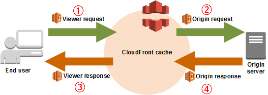

# AWS Lambda@Edge

## Labda@Edge로 SPA SEO 적용하기.

### 원인

React로 작성한 SPA(Single Page Application)중 일부 경로를 카카오톡, 구글에 공유시 원하는 이미지와 내용이 뜨도록 해달라고 요청이 들어옴.  
OG(Open Graph) 설정이 필요했고, react-helmet -> react-snap 을 시도 해보았으나 [여러 이유들](#reasons)로 인해 안된다는 것을 깨닫고 Lambda@Edge를 시도 해봄.

### Lambda@Edge 란

페이지가 s3/cloudfront에 올라가있기 때문에 **Lambda@Edge**라는 선택지가 있었다. [AWS](https://aws.amazon.com/ko/lambda/edge/)에서 이렇게 소개하고 있다.

> Lambda@Edge는 Amazon CloudFront의 기능 중 하나로서 애플리케이션의 사용자에게 더 가까운 위치에서 코드를 실행하여 성능을 개선하고 지연 시간을 단축할 수 있게 해 줍니다. Lambda@Edge를 사용하면 전 세계 여러 위치에 있는 인프라를 프로비저닝하거나 관리하지 않아도 됩니다. (중략)

Lambda@Edge는 아래와 같은 4가지 트리거를 가지고 있다.


- ①CloudFront가 최종 사용자(Viewer)의 요청을 수신한 후(Viewer Request)
- ②CloudFront가 오리진에 요청을 전달하기 전(Origin Request)
- ③CloudFront가 오리진으로부터 응답을 수신한 후(Origin Response)
- ④CloudFront가 최종 사용자(Viewer)에게 응답을 전달하기 전(Viewer Response)

각 트리거에 Lambda 함수를 등록해서 트리거가 실행될 때 그 함수가 실행되는게 Lambda@Edge다.
이때 ①, ④는 캐싱이 일어나지 않고 ②, ③을 거쳐 돌아온 값이 CloudFront에 캐싱된다.

### Open Graph(OG)

SNS에서 웹페이지를 표현하기 위해 만들어진 프로토콜이다. 몰랐는데 메타(페이스북 회사)에서 만든 개념인 모양이다. [자세한 내용](https://ogp.me/)  
Html의 <head>에 <meta>를 추가해서 표현할 수 있다.

```html
<!DOCTYPE >
<html>
  <head>
    ...
    <meta property="og:title" content="MY BLOG" />
    <meta
      property="og:description"
      content="My small space for memorizing anything"
    />
    <meta property="og:image" content="https://...." />
    <meta property="og:url" content="https://...." />
    <meta property="og:type" content="website" />
    ...
  </head>
  <body>
    ...
  </body>
</html>
```

### Lambda@Edge로 SPA에 SEO 반영하기

나는 위의 이미지에서 ②번 **Origin Request**를 이용하기로 했다. 참고했던 여러가지 글들에서는 크롤러에만 적용하도록 하기 위해 ①번 Viewer Request에서 봇 또는 크롤러인지 검사하고 ②번 Origin Request 또는 ③번 Origin Response에서 값을 변경해 내려주는 방식을 사용했다. 이러기 위해서 cloudFront 캐시를 못하게 하거나<sub>[[1]](#case1)</sub>, cloudFront의 Header 기반 캐싱을 이용해서 커스텀 header를 만들고 봇일때에는 그 값을 설정하고 그 header를 기준으로 캐싱하게 한다<sub>[[2]](#case2)</sub>.  
내가 위처럼 크롤러나 봇을 감지하는 방법을 사용하지 않았던 이유는 아래 3가지다.

- 봇이나 크롤러를 user_agent를 이용해서 직접 걸러줘야 하는데 나중에 추가될 봇들이나 이름이 변경되면 감지 되지 않는 것이 싫었다.
- Viewer Request는 항상 실행되니까 실행될 함수를 줄이기 위해서였다.
- <sub>[[2]](#case2)</sub>의 header기반 캐싱법을 늦게 발견했다.
  그래서 나는 봇이든 일반 사용자든 들어왔을때 상관없이 같은 값을 보여주는 방향으로 잡았다.  
  방법은 다음과 같다. (S3, CloudFront 설정이 되어있고, build된 파일이 올라가있다고 가정한다.)

1. 먼저 S3의 웹페이지 루트 경로에 ogConfig.json을 추가한다. ogConfig.json은 경로와 해당 경로에 대해 OG설정값들을 적는다. 예시는 아래와 같다.
    ```json
    {
      "/search/info": {
        "og:image": "/og_img/search/info/meta.png",
        "og:title": "프로필",
        "og:url": "https://pracoon.com/search/info",
        "og:description": "개인적이고 주관적인 페이지 입니다"
      }
    }
    ```
    여기서 설정한 옵션들은 다음 단계(TODO:)에서 반영을 해주어야 한다.
2. 원하는 경로만 OG(OpenGraph)값을 바꾸고 싶다. 요청이 들어오면 ②`Origin Response`에서 먼저 `ogConfig.json`파일을 불러온다.
    ```javascript
    const aws = require("aws-sdk");

    const s3 = new aws.S3({
      region: "ap-northeast-2",
    });
    // ogConfig.json 파일 읽어오기
    const configParam = {
      Bucket: BUCKET_NAME,
      Key: `ogConfig.json`,
    };
    let configStr = "";
    try {
      const configObj = await s3.getObject(configParam).promise();
      configStr = configObj?.Body;
    } catch (err) {
      console.log("CONFIG OBJ ERROR: " + err);
      callback(null, request);
      return;
    }
    const configJSON = JSON.parse(configStr);
    ```
3. 위에서 가져온 ogConfig.json이 있으면, request.uri에 해당하는 옵션이 있는지 찾는다. request.uri가 위에 예시로 든 ogConfig.json의
ex) 
---
### 팁

- 작성시점 기준(2022.02.16) Lambda@Edge는 버지니아 북부 리전에서만 사용 가능하다. 근데 cloudwatch에서 실행된 함수의 로그는 cloudwatch를 호출한 리전에 남아있다!! 이걸 몰라서 한동안 업로드 시점의 로그만 보고 하고 있었다.
- facebook과 카카오톡은 og:url경로의 데이터를 불러오는 모양이다. facebook이랑 카톡은 안되고 구글 행아웃은 되길래 도대체 왜이러지 했는데 og:url도 원하는 경로로 바꿔주니까 바로 된다. 덕분에 하루종일 삽질을 했다.

---

### <a id="reasons" >다른 방법 실패 이유</a>

#### react-helmet

아주 간단한 이유다. **react-helmet**은 js가 실행되고 meta tag 를 달아준다. Google과 Facebook은 js까지 실행한 후 meta tag값을 가져오기 때문에 문제가 없다.
그러나 카카오톡 네이버등은 html파일만 읽기 때문에 react-helmet으론 대응할 수 없다.

#### react-snap

그래서 static파일을 자동생성해주는 **react-snap**으로 시도를 했다. 테스트 해본 결과 로컬에서는 잘 되는데, Jenkins 배포 중에 실패를 했다. react-snap은 [puppeteer](https://github.com/puppeteer/puppeteer)를 이용해서 root페이지 부터 나타난 링크들을 모두 돌아보며 해당 링크의 경로에 대한 index.html을 모두 생성한다. 예를들어, 내 메인 페이지에 `/notice`, `/info`, `/contact` 로 가는 링크가 있으면 그걸 모두 읽어서 각각 `/notice/index.html`,`/info/index.html`, `/contact/index.html`을 만들어준다. 아주 편하고 좋다.  
문제는 우리 홈페이지 `/*.html`로 되어 있는 링크들이 몇가지 있었고, 이것들이 jenkins에서 build시 에러를 일으켰다. 이미 스태틱 페이지들이라 따로 스태택페이지를 제작해줄 필요가 없어서 빼려고 했으나, **react-snap 에는 include 옵션은 있어도 exclude 옵션이 없다.** react-snap이 영감을 얻은 react-snapshot에는 exclude옵션이 있지만 이건 deprecate되어서 시도하지 않았다.

#### ~~스태틱 파일 개별 생성~~

react-snap을 사용하는 대신 직접 만들어 줄까 생각해보긴 했지만, 이건 이후에 확장성을 고려하면 최악의 선택지이다.

---

### 참고자료

#### 큰도움

- [람다 이벤트 구조 확인](https://docs.aws.amazon.com/ko_kr/AmazonCloudFront/latest/DeveloperGuide/lambda-event-structure.html)
- [하단에 '디버깅의 어려움 부분' 덕분에 로그를 찾을 수 있었다.](https://blog.roto.codes/odc-tech-stack-aws-lambda-edge/)
- [카카오톡 OG Cache 제거](https://developers.kakao.com/tool/clear/og)
- [페이스북 OG 확인](https://developers.facebook.com/tools/debug)
- [같은 상황에 대한 내용1. 설명이 좀 더 잘 되어 있다.](https://velog.io/@alvin/AWS-LambdaEdge%EB%A1%9C-CSR-%ED%99%98%EA%B2%BD%EC%97%90%EC%84%9C-SEO-%EC%B2%98%EB%A6%AC%ED%95%98%EA%B8%B0) <a name="case2">[2]</a>

#### 중간도움

- [같은 상황에 대한 내용2](https://uzihoon.com/post/8f203610-8e67-11ea-925d-abc1dfcb23bd)
- [같은 상황에 대한 내용3](https://ninpeng.tistory.com/3) <a name="case1">[1]</a>
- [다른 글들에 있는 람다엣지 설명의 원조격](https://docs.aws.amazon.com/ko_kr/lambda/latest/dg/lambda-edge.html)
- [공식 페이지의 람다엣지 예제](https://docs.aws.amazon.com/ko_kr/AmazonCloudFront/latest/DeveloperGuide/lambda-examples.html)

#### 관련 참고

- [Lambda 비용 계산](https://calculator.aws/#/createCalculator/Lambda) (백만건으로 쳤을때 13.10USD 정도로 보인다.)
- [Lambda 비용 설명](https://aws.amazon.com/ko/lambda/pricing/#Lambda.40Edge_Pricing)
